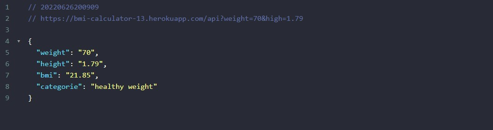

# BMI Calculator API

## Project

This is a simple api that can calculate a person's BMI using weight and height. It's one of my first Node JS APIs available publicly.

## Technologies

- JavaScript
- NodeJS
- ExpressJS
- Cors
- Nodemon

## How to use it

It's very simple, the api needs two parameters to calculate BMI:

- Weight in kg
- Height in m

The api was deployed and you can use it passing weight and height as parameters in a link, as follows:

`https://bmi-calculator-13.herokuapp.com/api?weight=70&height=1.79`

_As you can see in this example, I used 70kg as weight and 1.79m as height._

The API returns a JSON file with the following key values:

- weight
- height
- bmi
- categorie of bmi

Exemple Request:

## How it works

To calculate the BMI, the following formula was used:

_weight / (height x height)_

To determine the BMI categories, I followed the US Centers for Disease Control and Prevention specifications.

Check out an [app that uses this API](https://github.com/GabrielGustavoMS/BMICalculatorAPP)

## References

- [BMI's Formula - Diabetes Obesity Center](<https://centrodeobesidadeediabetes.org.br/tudo-sobre-obesidade/calculadora-de-imc/#:~:text=Compartilhar%3A,ao%20quadrado%20(em%20metros).>)

- [BMI Categories - CDC](https://www.cdc.gov/obesity/basics/adult-defining.html#:~:text=Adult%20Body%20Mass%20Index&text=If%20your%20BMI%20is%20less,falls%20within%20the%20obesity%20range.)
